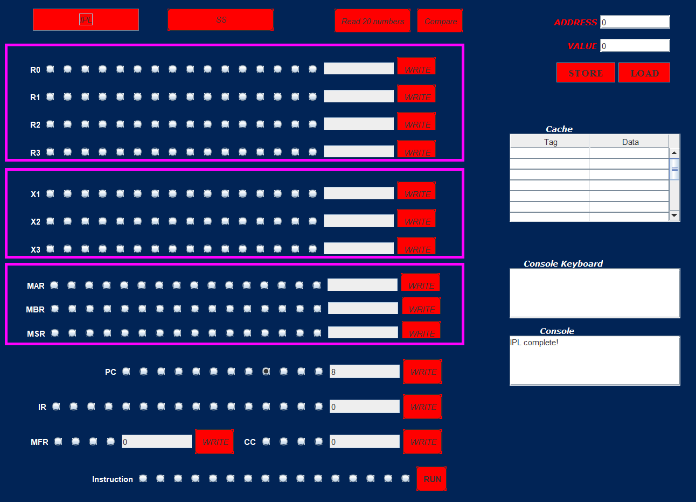

# CISC Simulator

## Description
This project is a fairly complex classical CISC computer emulator. Components like the Program Counter, Memory Address Register, Buffer register, Instruction Register, etc. have been emulated along with a simple GUI.

## Operations
The following operations are supported by the emulator:
- L&S
- CHKs
- FP/Vectors
- Traps
- and some enhanced memory and cache operations.

